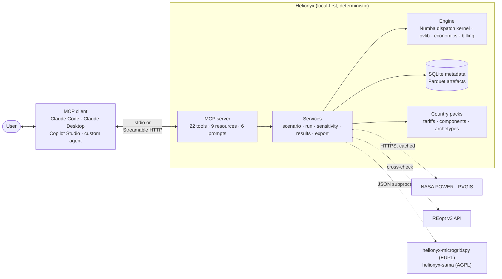
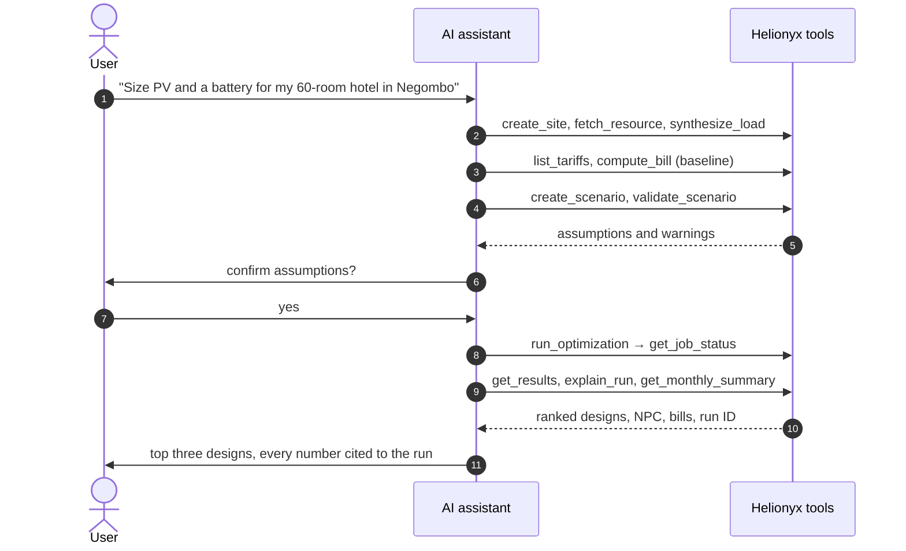

<p align="center">
  
</p>

<p align="center">
  <a href="https://pypi.org/project/helionyx/"></a>
  <a href="https://registry.modelcontextprotocol.io/v0/servers?search=io.github.Jayzilva/helionyx"></a>
  
  
</p>

# Helionyx

**Size hybrid energy systems by talking to your AI assistant.** Helionyx is an open-source
Model Context Protocol (MCP) server that sizes solar PV, wind, battery storage, diesel
generator and grid-connected systems. It runs the classic techno-economic workflow:

1. simulate every candidate design hour by hour for a full year;
2. discard designs that break your constraints;
3. rank the rest by net present cost (NPC), with payback, LCOE, bills and emissions.

<p align="center">
  
</p>

The assistant never invents numbers. It asks scoping questions, calls deterministic tools and
explains the results; every figure comes from a solver run with a run ID that anyone can
reproduce. Use it for pre-feasibility studies, client proposals, rural electrification
planning, teaching and cross-checking other tools.

**Why Helionyx**

- **Grounded answers:** the solver produces every number; the assistant only explains them.
- **Complete method:** hourly dispatch (load following, cycle charging, TOU grid strategy),
  life-cycle economics, tariffs with TOU, demand charges and export schemes, grid outages.
- **Beyond a single answer:** sensitivity grids, Pareto trade-offs between cost, CO₂ and
  reliability, multi-year load growth with staged expansion.
- **Cross-checked:** compare against REopt, MicroGridsPy and SAMA from the same scenario.
- **Open and local:** Apache-2.0, runs on your machine, works offline with bundled data, exports
  HOMER-ready time series and Excel reports.

## Get started

Pick the way you use AI tools. Each one takes about a minute.

<p align="center">
  
</p>

| Client | Install |
|---|---|
| **Claude Code** | `claude mcp add helionyx -- uvx helionyx serve` |
| **Claude Desktop** | Download [`helionyx-…-claude-desktop.mcpb`](https://github.com/Jayzilva/helionyx/releases/latest) from the latest release and open it |
| **Smithery** | [smithery.ai/servers/gitdevjay/helionyx](https://smithery.ai/servers/gitdevjay/helionyx) |
| **Any MCP client** (stdio) | Command `uvx`, arguments `helionyx serve` ([uv](https://docs.astral.sh/uv/) required) |
| **Python** | `pip install helionyx`, then `helionyx serve` |

Then ask, for example:

> Size a PV and battery system for a 60-room hotel in Negombo on the CEB hotel tariff. We have
> about 1,200 m² of usable roof.

The [quickstart](https://github.com/Jayzilva/helionyx/blob/main/docs/quickstart.md) walks through a first study in under ten minutes.

## Where to find Helionyx

| Where | Link |
|---|---|
| Source code and releases | [github.com/Jayzilva/helionyx](https://github.com/Jayzilva/helionyx) · [releases](https://github.com/Jayzilva/helionyx/releases) |
| PyPI | [pypi.org/project/helionyx](https://pypi.org/project/helionyx/) |
| Smithery | [smithery.ai/servers/gitdevjay/helionyx](https://smithery.ai/servers/gitdevjay/helionyx) |
| Official MCP Registry | `io.github.Jayzilva/helionyx` ([registry entry, JSON](https://registry.modelcontextprotocol.io/v0/servers?search=io.github.Jayzilva/helionyx)) |

## Data and accuracy

Helionyx ships with a Sri Lankan country pack (`lk`): CEB and LECO tariff structures and export
schemes, weather alignment to Asia/Colombo time, grid outage patterns and load archetypes for
Sri Lankan buildings. The engine itself is country-agnostic; new countries are added as data
packs ([data-pack guide](https://github.com/Jayzilva/helionyx/blob/main/docs/data-pack-guide.md)).

> **The tariff rates, component costs, fuel price, discount rates and emission factors in the
> `lk` pack are unverified placeholders.** Use results to learn the tool and to compare
> options, not for real decisions, until the data is verified. `validate_scenario` raises
> warning HNX-W001 for every unverified tariff. See the [disclaimer](https://github.com/Jayzilva/helionyx/blob/main/DISCLAIMER.md).

Releases and changes are listed in the [changelog](https://github.com/Jayzilva/helionyx/blob/main/CHANGELOG.md). Hosted mode with Microsoft
Entra ID sign-in and OpenTelemetry monitoring are in development for 1.0.

## Architecture



The server never calls an LLM. Copyleft solvers run as separate processes, so the core
stays Apache-2.0.

## A sizing conversation



## Solvers

| Solver | Method | Use it for | Licence and install |
|---|---|---|---|
| `native` | Full enumeration, 8,760-hour dispatch | The default; exact optimum of the search space | Built in |
| `heuristic` | Seeded multi-start pattern search | Spaces above the enumeration limit: up to 50 million candidates, sampled within a budget of 50 to 50,000 evaluations (default 4,000) | Built in |
| `reopt` | MILP with perfect foresight (NREL REopt v3) | Cross-checking grid-connected designs | API key; load leaves the machine |
| `microgridspy` | LP with HiGHS | Cross-checking off-grid designs | `helionyx-microgridspy`, EUPL-1.2 |
| `sama` | Particle swarm | Cross-checking off-grid designs | `helionyx-sama`, AGPL-3.0 |

`compare_runs` puts the results side by side. Multi-year scenarios run on `native` and
`heuristic` only.

## Multi-year analysis

<p align="center">
  
</p>

Add `multi_year` to a scenario to grow the load and search a staged investment:

```yaml
multi_year:
  load_growth_rate: 0.03        # year y load = year-1 load × 1.03^(y−1)
  sample_every_years: 5         # plus each stage boundary and the last year
  expansion:
    - year: 10
      pv_add_kwp: [0, 50, 100]
      bess_add_kwh: [0, 150]
```

The expansion sizes become extra search axes. Stage capital enters the cash flow in its
year, with its own replacements and salvage, and reliability constraints must hold in
every sampled year. Each candidate reports its sampled years under `multi_year.years`.
See [the methodology](https://github.com/Jayzilva/helionyx/blob/main/docs/methodology.md) (decision D20).

## Features

- **Resource data:** hourly GHI, temperature and wind from NASA POWER (and PVGIS where
  covered), CSV import, on-disk caching, offline mode, UTC → local civil time alignment,
  leap-day removal and gap filling. NASA POWER 2023 data for three Sri Lankan sites is
  bundled, so the reference cases run offline.
- **Load profiles:** 11 synthetic archetypes, random variability with a seed, calibration to
  12 monthly bills, composite loads and measured-load import (15/30/60-minute).
- **Tariffs and bills:** versioned YAML tariffs with flat, block and TOU energy charges,
  fixed, demand and minimum charges, levies, and the net metering, net accounting and net
  plus export schemes.
- **Scenario builder:** defaults from the country pack, a full assumption audit (origin,
  source and date for every value), validation rules, SHA-256 scenario hashes, versioning
  and YAML round-trips. Scheduled and random grid outages.
- **Simulation and optimisation:** an 8,760-hour dispatch kernel in Numba (PV via pvlib,
  wind power curves, idealised battery, diesel genset with load-following or
  cycle-charging, grid-connected TOU strategy), parallel enumerative search, HOMER-style
  economics (NPC, LCOE, replacements, salvage, payback, IRR) and emissions.
- **Search:** full enumeration, or a seeded heuristic pattern search for spaces of up to 50
  million candidates; Pareto front of NPC, CO₂ and capacity shortage.
- **Multi-year analysis:** annual load growth and up to three capacity-expansion stages,
  searched together with the initial system and costed year by year.
- **Sensitivity:** one-variable sweeps and two-variable grids with re-optimisation, optimal
  architecture per case and NPC elasticities.
- **Grounded explanations:** structured cost breakdowns, cost drivers, binding
  constraints, dispatch statistics and comparisons, with provenance and a disclaimer on
  every result.
- **Exports:** HOMER-importable series plus a parameter sheet, Markdown and Excel reports,
  hourly time series and scenario YAML.
- **Cross-check solvers** compared with `compare_runs`: REopt v3 (API key), and MicroGridsPy
  and SAMA as separately licensed add-on packages (see [docs/adapters.md](https://github.com/Jayzilva/helionyx/blob/main/docs/adapters.md)).
- **HOMER parity kit:** protocol, results template and `helionyx parity compare`.
- **Claude skill and MCP prompts** for guided workflows, plus a grounding checker.

## Install from source

For development (Python 3.11–3.13):

```bash
git clone https://github.com/Jayzilva/helionyx.git
cd helionyx
uv venv
uv pip install -e ".[dev]"      # or: python -m venv .venv, then pip install -e ".[dev]"
```

See [CONTRIBUTING](https://github.com/Jayzilva/helionyx/blob/main/CONTRIBUTING.md) for the checks to run before a pull request.

## Command-line quickstart

Run a reference case from the command line (works offline):

```bash
helionyx run reference_cases/rc2_hotel_negombo.yaml
```

This sizes PV and battery for a 60-room hotel in Negombo on the CEB hotel TOU tariff and
prints the five lowest-NPC designs with the grid-only base case. The first run takes a
little longer while Numba compiles the dispatch kernel.

See [docs/quickstart.md](https://github.com/Jayzilva/helionyx/blob/main/docs/quickstart.md) for a full walk-through.

## Connect to an AI assistant

### Claude Code

```bash
claude mcp add helionyx -- uvx helionyx serve
```

### Claude Desktop

Download the `.mcpb` bundle from the [latest release](https://github.com/Jayzilva/helionyx/releases/latest) and open it; Claude
Desktop installs Helionyx and asks for the optional settings (workspace folder, offline
mode, REopt API key). Or add this to `claude_desktop_config.json`:

```json
{
  "mcpServers": {
    "helionyx": {
      "command": "uvx",
      "args": ["helionyx", "serve"]
    }
  }
}
```

### Streamable HTTP (local testing only)

```bash
helionyx serve --transport http --port 8080
```

This serves MCP at `http://127.0.0.1:8080/mcp` and a health check at `/healthz`. Set
`HNX_API_KEY` to require `Authorization: Bearer <key>` (development-grade protection; the CLI
refuses a non-local bind without it). OAuth 2.1 with Microsoft Entra ID arrives with hosted
mode in v1.0.

### Claude skill

Copy the skill so Claude follows the Helionyx workflow and grounding rules:

```bash
cp -r skills/helionyx ~/.claude/skills/
```

Clients without skill support can use the MCP prompts listed below instead. See
[docs/skill-guide.md](https://github.com/Jayzilva/helionyx/blob/main/docs/skill-guide.md).

## MCP tools

| # | Tool | Purpose |
|---|---|---|
| 1 | `create_site` | Register a site (location, time zone, country pack) |
| 2 | `fetch_resource` | Hourly GHI, temperature and wind from NASA POWER or PVGIS, aligned to local time |
| 3 | `import_timeseries` | Import a measured load or resource series from CSV; extend 4+ weeks of load to a year |
| 4 | `synthesize_load` | Build a load from archetypes, optionally calibrated to monthly bills |
| 5 | `list_tariffs` | Browse the tariff pack |
| 6 | `get_tariff` | Tariff charges, TOU periods, export schemes and staleness warnings |
| 7 | `compute_bill` | Baseline bill for a load, or a bill for import/export series |
| 8 | `list_components` | Browse the component library |
| 9 | `create_scenario` | Combine all inputs and the search space into a scenario |
| 10 | `validate_scenario` | Errors, warnings and the full assumption audit |
| 11 | `run_optimization` | Start an asynchronous job: `native` (enumeration), `heuristic`, `reopt`, `microgridspy` or `sama` |
| 12 | `get_job_status` | Poll a job (state, progress, ETA, run ID) |
| 13 | `cancel_job` | Cancel a job |
| 14 | `get_results` | Ranked designs, base case, search method, provenance and disclaimer |
| 14b | `get_pareto_front` | Non-dominated designs over NPC, CO₂ and capacity shortage |
| 15 | `explain_run` | Structured explanation of one design |
| 16 | `get_monthly_summary` | Monthly energy flows and bills before and after |
| 17 | `run_sensitivity` | One-variable sweep or two-variable grid with re-optimisation (asynchronous) |
| 18 | `get_sensitivity_results` | Optimal design per value and NPC elasticity |
| 19 | `compare_runs` | Side-by-side comparison of runs (for example native vs REopt) |
| 20 | `export_homer_csv` | HOMER-importable series and parameter sheet |
| 21 | `export_report` | Client report in Markdown or Excel |

`run_optimization`, `run_sensitivity` and `get_job_status` accept `wait_seconds` (0–20).
With 0 they return immediately; otherwise they wait and send progress notifications.

### Resources

| URI | Content |
|---|---|
| `hnx://packs/{country}/tariffs/{tariff_id}` | Tariff definition (JSON) |
| `hnx://packs/{country}/components/{type}` | Component library entries (JSON) |
| `hnx://packs/{country}/archetypes/{archetype}` | Load archetype definition (JSON) |
| `hnx://datasets/{dataset_id}.csv` | Hourly resource or load series |
| `hnx://scenarios/{scenario_id}` | Canonical resolved scenario (JSON) |
| `hnx://runs/{run_id}/results.csv` | Every candidate with sizes, metrics and feasibility |
| `hnx://runs/{run_id}/candidates/{rank}/timeseries.csv` | Hourly flows of a candidate |
| `hnx://runs/{run_id}/report.md` | Generated report |
| `hnx://docs/methodology` | Equations and documented differences from HOMER |

### Prompts

| Prompt | Purpose |
|---|---|
| `size_cni_rooftop_tou` | Commercial or industrial rooftop PV + battery under a TOU tariff |
| `size_offgrid_village` | Off-grid village microgrid |
| `diesel_replacement_island` | Hybridise an existing diesel system |
| `explain_for_client` | Grounded explanation for a technical or executive audience |
| `homer_crosscheck` | Guided export to HOMER Pro and a comparison checklist |
| `teach_me` | Tutoring with small worked runs |

## Command-line interface

| Command | Purpose |
|---|---|
| `helionyx serve [--transport stdio\|http] [--host] [--port]` | Start the MCP server |
| `helionyx run <study.yaml> [--solver native] [--top 5] [--sort-by npc]` | Run a study or scenario file |
| `helionyx results <run_id> [--top 10]` | Print results |
| `helionyx export homer <scenario_id> <dir>` | Write HOMER files |
| `helionyx export report <run_id> [--format md] [--output path]` | Write a report |
| `helionyx pack validate <path>` | Validate a data pack |
| `helionyx pack build <path> <out_dir>` | Build a release archive and checksum manifest (maintainers) |
| `helionyx pack update [--country lk] [--manifest URL]` | Install a newer, checksum-verified pack release |
| `helionyx parity compare <homer.csv> [--output report.md]` | Compare HOMER Pro results with Helionyx on RC-1…RC-3 |
| `helionyx eval grounding <transcripts_dir> [--threshold 0.95]` | Run the grounding checker |
| `helionyx version` | Print the version |

## Configuration

Copy [`.env.example`](https://github.com/Jayzilva/helionyx/blob/main/.env.example) or set these environment variables:

| Variable | Default | Meaning |
|---|---|---|
| `HNX_WORKSPACE` | `~/.helionyx` | Workspace for the database, artefacts, cache and exports. File paths outside it are rejected. |
| `HNX_OFFLINE` | `0` | `1` uses only cached and bundled data; no network calls |
| `HNX_MAX_JOBS` | `2` | Maximum concurrent jobs per user |
| `HNX_JOB_TIMEOUT_S` | `900` | Job time limit in seconds |
| `HNX_REOPT_API_KEY` | — | REopt API key (developer.nlr.gov) |
| `HNX_REOPT_FIXTURE` | — | Replay a recorded REopt response instead of calling the API (tests) |
| `HNX_REOPT_URL` | `https://developer.nlr.gov/api/reopt/stable` | REopt base URL |
| `HNX_LOG_LEVEL` | `INFO` | Log level |
| `HNX_API_KEY` | — | Bearer key required by HTTP mode (development only); needed to bind to a non-local address |
| `HNX_MICROGRIDSPY_CMD` | `helionyx-microgridspy` | Command of the MicroGridsPy adapter package |
| `HNX_SAMA_CMD` | `helionyx-sama` | Command of the SAMA adapter package |

## Repository layout

```text
src/helionyx/
  api/            MCP server, CLI, Streamable HTTP host, output schemas
  services/       site/resource, load, tariff, scenario, run, sensitivity, results, export, study
  core/           Pydantic models, engine (PV, wind, dispatch kernel, outages), economics, billing
  adapters/       solver adapter interface and REopt v3 adapter
  infra/          settings, SQLite store, Parquet artefact store, HTTP cache, jobs, pack loader
  packs/lk/       Sri Lanka country pack (tariffs, components, archetypes, emissions, defaults, samples)
  templates/      report and HOMER parameter templates, methodology
packages/         separately licensed solver adapters (helionyx-microgridspy, helionyx-sama)
skills/helionyx/  Claude skill
reference_cases/  RC-1 to RC-3 study files
evals/grounding/  grounding evaluation prompt set
scripts/          maintainer scripts (refresh bundled samples)
tests/            unit, property, contract and regression tests
docs/             quickstart, methodology, data-pack guide, skill guide, solver adapters, assets/ (graphics)
```

## Documentation

- [Quickstart](https://github.com/Jayzilva/helionyx/blob/main/docs/quickstart.md)
- [Methodology](https://github.com/Jayzilva/helionyx/blob/main/docs/methodology.md)
- [Data-pack guide](https://github.com/Jayzilva/helionyx/blob/main/docs/data-pack-guide.md)
- [Skill guide](https://github.com/Jayzilva/helionyx/blob/main/docs/skill-guide.md)
- [Solver adapters](https://github.com/Jayzilva/helionyx/blob/main/docs/adapters.md)
- [Releases](https://github.com/Jayzilva/helionyx/releases)
- [Contributing](https://github.com/Jayzilva/helionyx/blob/main/CONTRIBUTING.md) · [Changelog](https://github.com/Jayzilva/helionyx/blob/main/CHANGELOG.md)

## Licence

- **Code:** [Apache License 2.0](https://github.com/Jayzilva/helionyx/blob/main/LICENSE).
- **Data packs:** CC BY 4.0, citing the original source of each record.
- Copyleft solvers ship as separate packages run as subprocesses: `helionyx-microgridspy`
  (EUPL-1.2) and `helionyx-sama` (AGPL-3.0). The core never imports them.

## Disclaimer

> Helionyx results are **pre-feasibility estimates** based on simplified models, synthetic or
> user-supplied data, and dated, **unverified placeholder** tariff and cost assumptions. They
> are not engineering design, a bankable yield assessment, financial advice or a
> grid-compliance study, and are no substitute for review by a chartered engineer. The
> software is provided "as is", without warranty or liability (Apache-2.0 §7–8). Helionyx is
> an independent project, not affiliated with or endorsed by HOMER Energy / UL Solutions,
> NREL, NASA, the EC JRC, CEB, LECO or Anthropic; trademarks belong to their owners. Some
> features send site or load data to third-party services. Read the full
> [disclaimer](https://github.com/Jayzilva/helionyx/blob/main/DISCLAIMER.md) before use.

<!-- mcp-name: io.github.Jayzilva/helionyx -->
