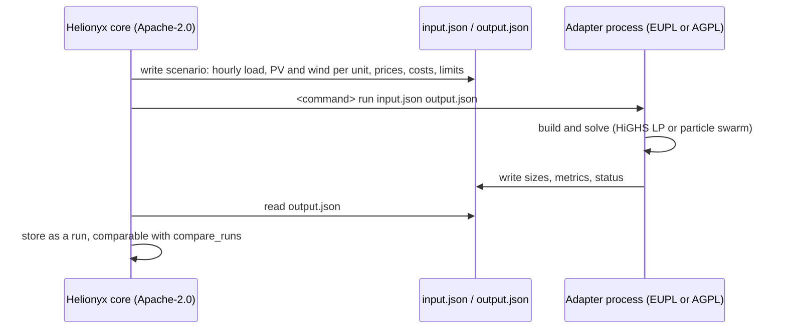

# Solver adapters

Helionyx's own engine enumerates candidate designs and simulates each one with a rule-based
hourly dispatch. Three other solvers can size the same scenario so the answers can be
cross-checked with `compare_runs`:

| Solver | `solver` value | Method | Licence | How it runs |
|---|---|---|---|---|
| Helionyx native | `native` | Enumeration of the size grid, rule-based dispatch | Apache-2.0 | In process |
| Helionyx heuristic | `heuristic` | Seeded multi-start pattern search on the size grid | Apache-2.0 | In process |
| REopt API v3 | `reopt` | MILP, perfect-foresight dispatch, continuous sizes | NREL web API | HTTPS, API key |
| MicroGridsPy 0.4 | `microgridspy` | LP (linopy + HiGHS), perfect foresight, annualised costs | EUPL-1.2 | Subprocess, package `helionyx-microgridspy` |
| SAMAPy 1.0.6 | `sama` | Particle swarm, rule-based dispatch | AGPL-3.0 | Subprocess, package `helionyx-sama` |

## Licence isolation

MicroGridsPy (EUPL-1.2) and SAMAPy (AGPL-3.0) are copyleft. Each therefore ships as its own
package under `packages/`, carrying the solver's licence, and runs as a separate program.
The Apache-2.0 core never imports either solver; a test enforces this. If you run Helionyx as
a network service with `helionyx-sama` installed, the AGPL network clause applies to that
package and SAMAPy.

## Subprocess protocol (`helionyx-adapter-io/1`)



```text
<command> run <input.json> <output.json>
```

The command is `helionyx-microgridspy` / `helionyx-sama`, or whatever `HNX_MICROGRIDSPY_CMD` /
`HNX_SAMA_CMD` names (for example the full path of a program in another virtual environment).
If it is missing, `run_optimization` fails at once with HNX-E003 and an install hint.

**Input** (written by `helionyx.adapters.subprocess_adapter.build_input`):

| Field | Content |
|---|---|
| `schema` | `"helionyx-adapter-io/1"` |
| `scenario_id`, `scenario_hash`, `currency`, `grid_mode`, `seed`, `site` | Identification and context |
| `time_series.load_kw` | 8,760 hourly load values (kW) |
| `time_series.pv_kw_per_kwp` | Helionyx's PV AC output per kWp (pvlib, including inverter efficiency and clipping) |
| `time_series.wind_kw_per_turbine` | Output of one turbine (kW) |
| `time_series.grid_available` | 1 = grid available |
| `time_series.grid_import_price_per_kwh`, `grid_export_price_per_kwh` | Hourly energy price from the TOU periods and export rate (demand and fixed charges are not passed) |
| `components.<pv/wind/bess/converter/genset>` | Costs per unit, lifetime, technical parameters, `min_size`/`max_size` of the search space; genset full-load efficiency and diesel LHV |
| `economics` | Real discount rate, project life, fuel price, grid import/export limits |
| `constraints` | `max_capacity_shortage`, `min_renewable_fraction`, `max_pv_kwp` |
| `options` | `time_limit_s` and solver-specific options |

**Output:**

```json
{"schema": "helionyx-adapter-io/1", "status": "optimal | feasible | infeasible",
 "solver": {"name": "...", "version": "...", "label": "..."},
 "sizes": {"pv_kwp": 0, "wind_count": 0, "bess_kwh": 0, "bess_kw": 0, "genset_kw": 0},
 "metrics": {"npc": 0, "lcoe_per_kwh": 0, "initial_capital": 0, "renewable_fraction_pct": 0,
             "capacity_shortage_pct": 0, "fuel_l_per_yr": 0},
 "messages": ["..."]}
```

All money is in the scenario currency. Any status other than `optimal`, `feasible` or
`completed` becomes HNX-E005.

## Currency scaling

REopt range-checks money in US-dollar magnitudes, and SAMA's objective adds `1e-5 × NPC` to
penalty terms tuned for dollar amounts. Both adapters therefore divide all money by a scale
(the user's `fx_rate_per_usd`, else 300) on the way in and multiply results back. The optimum
of a linear cost model does not depend on the currency unit, so this changes only the balance
against SAMA's penalties, which is the intent.

## Known method differences

| Topic | Native | REopt | MicroGridsPy | SAMA |
|---|---|---|---|---|
| Sizes | Grid of user sizes | Continuous | Continuous (LP) | Continuous (PSO) |
| Dispatch | Rules (battery before genset) | Optimal with perfect foresight | Optimal with perfect foresight | Rules |
| Replacement and salvage | Explicit | Explicit (battery replacement year) | Annuity over each lifetime; no salvage | Explicit |
| Tariff | Full bill (energy, demand, fixed, minimum, levies) | Hourly energy price and monthly demand rate | Hourly energy price only | Hourly energy price only |
| Outages | Scheduled or random mask | Not passed | Not passed | Not passed |
| Wind | Power curve | Not mapped (v0.2) | Capacity factor per kW | Not mapped (v0.2) |

## Live cross-check results (7 October 2026)

All values use the **unverified placeholder** data of the `lk` pack and are method checks only.

**RC-2 hotel (grid-connected, PV + BESS):**

| Solver | PV (kWp) | BESS (kWh) | NPC (LKR) | Notes |
|---|---|---|---|---|
| Native | 175 | 0 | 124.3 M | 25 kWp size step; roof limit 180 kWp |
| REopt (live API) | 180 | 0 | 126.9 M | Run with REopt's default 0.5 %/yr PV degradation (now set to 0); simple payback 4.2 years vs 4.0 native |
| MicroGridsPy | 180 | 0 | 86.2 M | Energy price only: demand and fixed charges are not modelled, so the grid cost and NPC are lower |

**RC-1 island village (off-grid, PV + wind + BESS + diesel, shortage ≤ 1 %):**

| Solver | PV (kWp) | Wind (turbines) | BESS (kWh) | Genset (kW) | NPC (LKR) | RF (%) | Notes |
|---|---|---|---|---|---|---|---|
| Native | 75 | 4 | 150 | 40 | 101.3 M | 89.4 | Shortage 0.04 %; fuel 9,525 L/yr |
| MicroGridsPy | 74.1 | 3.9 | 114.0 | 17.2 | 85.3 M | 88.5 | Uses the full 1 % shortage; fuel 8,264 L/yr; 122 s |

**RC-3 estate village (off-grid, PV + BESS + diesel, shortage ≤ 2 %):**

| Solver | PV (kWp) | BESS (kWh) | Genset (kW) | NPC (LKR) | Notes |
|---|---|---|---|---|---|
| Native | 70 | 150 | 0 | 36.9 M | 10 kWp / 50 kWh size steps; shortage 1.55 % |
| MicroGridsPy | 65.8 | 117.1 | 0.9 | 30.8 M | Continuous LP with perfect foresight uses the full 2 % shortage allowance; annuity costing |
| SAMA (PSO 150 × 50) | 64.6 | 121.2 | 2.5 | 30.7 M | Shortage 2.0 %; fuel 540 L/yr; 156 s |

All three agree on the architecture of RC-2 (PV only, about 175–180 kWp at the roof limit).
On RC-1 and RC-3 the two external solvers find designs about 15–20 % cheaper than the native
optimum. MicroGridsPy and SAMA, with completely different methods (LP with perfect foresight vs
particle swarm with rule-based dispatch), agree with each other on RC-3 to within 0.1 % of NPC.
The gap to the native result comes mainly from the native size grid: the reference cases search
gensets of 0, 15, 20, 25 and 30 kW (RC-3) and spend less of the shortage allowance, while both
external solvers choose a 1–3 kW genset and use the full allowance. Adding finer genset and
battery sizes to the native search space closes most of the gap; this is the kind of finding the
cross-check is meant to surface.

### Adapter pitfall found during verification

`samapy.core` imports `Fitness` together with `Input_Data`, and `Fitness` copies every input
into module globals at import time. An adapter that only overwrites `InData` therefore sizes
SAMA's built-in default case. `helionyx-sama` re-synchronises all loaded `samapy` modules after
configuring the inputs (`_resync`).
