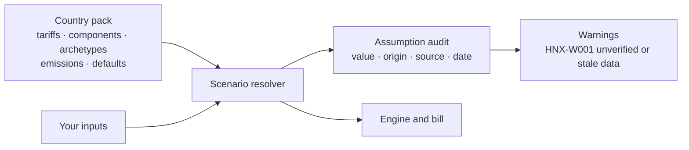
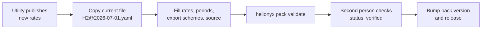

# Data-pack guide

The Helionyx engine is country-agnostic. Every tariff, cost, emission factor, load shape
and default lives in a **country pack**. Sri Lanka (`lk`) is the first pack.

> **Warning.** The current `lk` tariff rates, component costs, fuel price, discount and
> inflation rates and emission factors are **unverified placeholders** for development
> and testing. They must be replaced with sourced values before any real use (tariffs and export
> schemes, emission factors and genset fuel curves from official sources; component costs
> from a market survey). Records carry `status: unverified` and say
> "PLACEHOLDER" in their source text.

## How pack data reaches a result



Every value the user does not supply comes from the pack and is listed with its source and
date by `validate_scenario`, so a reviewer can see exactly what was assumed.

## Layout

```text
src/helionyx/packs/lk/
├── pack.yaml                 # manifest: id, version (CalVer), last_verified, maintainers, licence,
│                             # timezone, currency, weekend_days, staleness_months
├── tariffs/
│   ├── ceb/<category>@<effective_from>.yaml
│   └── leco/<category>@<effective_from>.yaml
├── components/               # pv.yaml, wind.yaml, bess.yaml, genset.yaml, converter.yaml
├── archetypes/               # hotel.yaml, rural_household.yaml, ... (11 archetypes)
├── emissions.yaml            # diesel and grid emission factors, grid renewable fraction
├── defaults.yaml             # sourced defaults keyed by scenario path, default components, roof density
└── samples/                  # bundled NASA POWER hourly data + samples.yaml manifest
```

Packs are licensed CC BY 4.0; each record cites its original source.

## Schemas

All schemas are Pydantic models in
[`src/helionyx/core/models/packs.py`](../src/helionyx/core/models/packs.py). Unknown keys
are rejected.

| Model | File | Key fields |
|---|---|---|
| `PackManifest` | `pack.yaml` | `id`, `name`, `version` (`YYYY.MM.patch`), `last_verified`, `maintainers`, `license`, `timezone`, `currency`, `weekend_days` (ISO weekday numbers), `staleness_months` |
| `Tariff` | `tariffs/**.yaml` | `id`, `utility`, `category`, `name`, `currency`, `effective_from`, `effective_to`, `status`, `source` (`document`, `url`, `retrieved_at`, `verified_by`), `tou_periods`, `charges`, `export_schemes`, `notes` |
| `Component` | `components/*.yaml` | `id`, `type` (pv, wind, bess, genset, converter), `name`, `currency`, `cost_year`, `status`, `source`, `unit` (kWp, turbine, kWh, kW, kW), `capital_per_unit`, `replacement_per_unit`, `om_per_unit_year`, `lifetime_years`, `technical` |
| `Archetype` | `archetypes/*.yaml` | `id`, `name`, `basis`, `synthetic`, `unit_label`, `typical_annual_kwh`, `weekday[24]`, `weekend[24]`, `monthly[12]`, `day_sigma`, `hour_sigma` |
| `Emissions` | `emissions.yaml` | `diesel_kg_co2_per_l`, `grid_kg_co2_per_kwh`, `grid_renewable_fraction` — each `{value, source, date}` |
| `PackDefaults` | `defaults.yaml` | `values` (dotted scenario path → `{value, source, date}`), `default_components`, `roof_kwp_per_m2` |

Tariff charges:

- `energy.type: flat` needs `rate_per_kwh`; `block` needs `blocks` (`up_to_kwh`,
  `rate_per_kwh`, optional per-slab `fixed_monthly`; the last slab has `up_to_kwh: null`);
  `tou` needs `rates_per_kwh` keyed by the names in `tou_periods`.
- `tou_periods` are local civil time windows with `days: all | weekday | weekend`. Windows
  may cross midnight.
- Optional `demand` (`per_kva_month`, `power_factor_assumption`), `fixed_monthly`,
  `minimum_monthly`, `levies_pct`.
- `export_schemes`: `net_metering` (`netting: total | by_period`, `credit_carry_forward`,
  `year_end: forfeit | pay`, `year_end_rate_per_kwh`), `net_accounting` and `net_plus`
  (`export_rate_per_kwh`, `settlement: monthly`). Omit a scheme the tariff does not offer.

Component `technical` blocks are validated per type (`PvTechnical`, `WindTechnical`,
`BessTechnical`, `GensetTechnical`, `ConverterTechnical`); any field can be overridden in a
scenario under `components.<type>.overrides`.

## Adding a tariff revision



1. Copy the current file, for example `tariffs/ceb/H2@2025-01-01.yaml`, to a new file named
   `<category>@<effective_from>.yaml`, e.g. `tariffs/ceb/H2@2026-07-01.yaml`.
2. Set `id: lk.ceb.H2@2026-07-01`. The ID must end with `@<effective_from>`, and the
   currency must match the pack currency.
3. Set `effective_from`, and set `effective_to` on the previous revision if it has ended.
4. Fill in the rates, periods and export schemes from the PUCSL decision. Record
   `source.document`, `source.url`, `source.retrieved_at` and `source.verified_by`.
5. Set `status: verified` only after a second person has checked the values.
6. Validate:

   ```bash
   helionyx pack validate src/helionyx/packs/lk
   ```

No code changes are needed. A scenario that references a category ID (`lk.ceb.H2`)
automatically uses the revision in effect on its analysis date; a full revision ID
(`lk.ceb.H2@2025-01-01`) pins one revision.

## Staleness warnings (HNX-W001)

`validate_scenario` and `get_tariff` raise HNX-W001 when:

- the pack's `last_verified` date is more than `staleness_months` (default 6) before the
  analysis date;
- the tariff has `status: unverified`;
- a newer revision of the same tariff exists.

## Maintainer checklist

- [ ] Check PUCSL, CEB and LECO announcements for tariff revisions and export-scheme changes.
- [ ] Check the CPC diesel price and update `economics.fuel_price_per_l` in `defaults.yaml`.
- [ ] Review component costs against recent supplier quotes.
- [ ] Update emission factors when new official statistics are published.
- [ ] Keep every record's `source` and date current; mark verified records `status: verified`.
- [ ] Bump `version` in `pack.yaml` (CalVer `YYYY.MM.patch`) and update `last_verified`.
- [ ] Run `helionyx pack validate src/helionyx/packs/lk` and the test suite.
- [ ] Note the change in `CHANGELOG.md`.

## Refreshing the bundled samples

`scripts/fetch_samples.py` downloads one year of NASA POWER hourly data (GHI, T2M, WS10M,
WS50M, UTC) for the sample sites and rewrites `samples/*.csv.gz` and `samples/samples.yaml`:

```bash
python scripts/fetch_samples.py
```

Samples are stored in UTC and go through the same alignment and gap-filling as live
downloads. Changing them changes regression results, so regenerate the goldens afterwards.

## Adding a new country

Create `src/helionyx/packs/<code>/` with the same layout and schemas. Engine code must not
contain country-specific literals; sites select a pack with `country_pack`.
