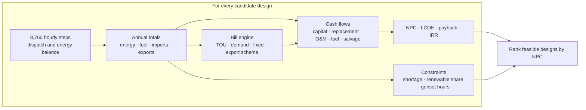

# Methodology

The normative calculation method is in
[`src/helionyx/templates/methodology.md`](../src/helionyx/templates/methodology.md). The MCP
server serves the same file as the resource `hnx://docs/methodology`, so assistants and
users read one source. It covers the time base and energy balance, PV, wind,
battery, genset, dispatch, economics, metrics, emissions, billing and numerical rules, and
lists the documented differences from HOMER Pro.

  

## From hourly flows to a ranking

Net present cost is the sum of every cash flow over the project life, discounted at the real
discount rate:

| Component | Counted as |
|---|---|
| Capital | Year 0 (or the year of an expansion stage) |
| Replacements | When each component reaches its lifetime (battery: throughput or float life; genset: run hours) |
| O&M, fuel, grid purchases | Every year, with real escalation for fuel and grid prices |
| Grid sales, salvage | Subtracted; salvage is the remaining life at the end of the project |

## Implementation notes

Modelling decisions worth knowing:

- **Year boundary in time alignment.** Converting UTC data to Asia/Colombo civil time
  (UTC+05:30) treats the year as circular: the first local half-hour of 1 January uses the
  last UTC hour of 31 December of the same year. This is recorded in provenance. The error is
  negligible for pre-feasibility work and avoids a second API call.
- **Cycle-charging hold.** `cc_hold_until_setpoint` keeps the genset running only in
  deficit hours. In surplus hours the genset is always off, because running it into a
  renewable surplus would only create excess energy.
- **Block tariffs.** Block (slab) energy charges are incremental. Each slab may carry
  its own fixed charge, applied when the month's consumption ends in that slab. This matches
  the CEB domestic structure with a single schema.

- **Multi-year analysis.** With `multi_year` in a scenario,
  year *y* uses the year-1 load × (1 + g)^(y−1). Each expansion stage adds capacity from the
  start of its year; its capital sits in year *y*−1 of the cash flow and it is replaced and
  salvaged on its own lifetime. The engine simulates sample years (the first and last year of
  each constant-capacity period, plus every `sample_every_years`-th year, default 5) and
  interpolates fuel, grid bills, throughput and genset hours linearly between them; NPC is
  then evaluated year by year. LCOE divides the annualised cost by the annuity-equivalent
  energy. Battery and genset lifetimes use the mean throughput per kWh and mean run hours over
  the years each bank is installed. Constraints (`max_capacity_shortage`,
  `min_renewable_fraction`, `max_genset_hours`, `max_export_kw`) must hold in every sampled
  year; `max_pv_kwp` applies to the final installed PV. With zero growth and no stages the
  result equals the single-year calculation. REopt, MicroGridsPy and SAMA refuse multi-year
  scenarios.

Other conventions worth knowing:

- An hour belongs to a TOU period or outage window when the window contains the hour's
  midpoint (so 18:30 windows align cleanly with hourly steps).
- Day types follow the 2023 calendar (1 January is a Sunday); the `lk` pack treats Saturday
  and Sunday as weekend days.
- Converter cost is charged per kW of battery inverter power; the PV inverter is in the PV
  cost (D9).
